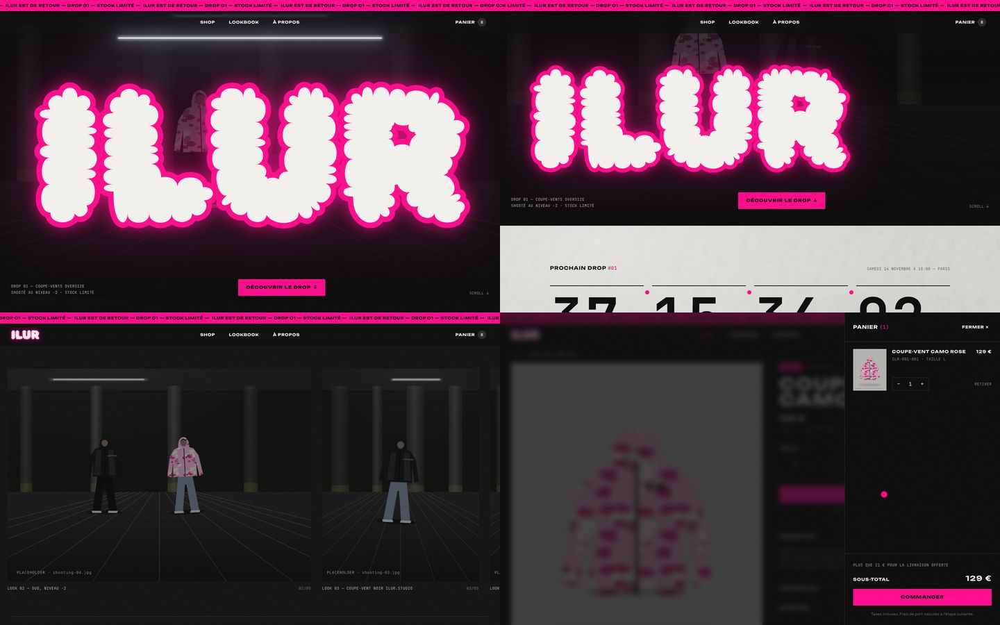

# ILUR.STUDIO — site e-commerce



Site du drop 01 d'ILUR : Next.js 16 (App Router) + TypeScript + Tailwind CSS 4, animations GSAP/ScrollTrigger, smooth scroll Lenis, transitions Framer Motion.

```bash
npm install
npm run dev        # http://localhost:3000
npm run build && npm start   # version production
```

Node 20+ recommandé.

---

## Ce qu'il y a dedans

| Page | Contenu |
|---|---|
| `/` | Preloader (compteur 000 → 100, logo néon, ouverture verticale) · barre d'annonce défilante · hero avec « ILUR » géant qui se range dans la nav au scroll · compte à rebours du drop + « Préviens-moi » · produits phares · lookbook horizontal épinglé · manifeste révélé mot par mot · footer avec logo géant |
| `/shop` | Grille filtrable (vestes, hauts, bas, accessoires) + tri (nouveautés, prix croissant/décroissant) |
| `/shop/[slug]` | Galerie (photo produit + photo portée), tailles XS → XXL avec stock, guide des tailles en modale, « Ajouter au panier », accordéons description / composition / entretien / livraison & retours |
| Panier | Tiroir latéral, quantités, sous-total, « Commander ». Sauvegardé dans le navigateur (localStorage). |
| `/mentions-legales`, `/cgv` | Modèles à compléter |

Effets globaux : grain animé, curseur rose « VOIR » sur les produits (souris uniquement), glow néon pulsé, transitions de page (volet rose).

---

## Remplacer les images

Toutes les images sont dans `public/images/`. Les fichiers actuels sont des **placeholders générés** (parking dessiné + silhouettes, mention « PLACEHOLDER » en bas). Remplace-les par les vraies photos **en gardant exactement le même nom** :

| Fichier | Où il apparaît | Format conseillé |
|---|---|---|
| `shooting-01.jpg` | Fond du hero + image Open Graph (partage réseaux) | Paysage, ~2400 × 1500 |
| `shooting-02.jpg` → `shooting-06.jpg` | Lookbook | Portrait ~1400 × 1900 (le 04 est en paysage) |
| `products/<slug>-1.jpg` | Photo produit (fond béton clair) | Portrait 4:5, ~1200 × 1500 |
| `products/<slug>-2.jpg` | Photo portée (affichée au survol + galerie) | Portrait 4:5, ~1200 × 1500 |

- Des JPG en haute qualité suffisent : `next/image` génère automatiquement l'AVIF/WebP aux bonnes tailles.
- Les légendes et l'ordre du lookbook se règlent dans `data/lookbook.ts` (pense à mettre à jour `w` et `h` si le ratio d'une photo change).
- Pour regénérer les placeholders : `npm run placeholders` (⚠️ écrase les fichiers du même nom).

### Le logo officiel

Par défaut, le logo est dessiné en CSS (police « Rubik Bubbles », lettres blanches, contour rose fluo, glow). Pour utiliser le vrai fichier :

1. Dépose-le dans `public/images/` (ex. `logo.png` détouré ou mieux `logo.svg`).
2. Dans `lib/site.ts`, mets `logoSrc: "/images/logo.png"`.

Il remplace alors le lettrage partout (nav, hero, preloader, footer). Si le ratio n'est pas ~2,4:1, ajuste `aspect-[2.4/1]` dans `components/ui/Logo.tsx`.

---

## Modifier les produits

Tout est dans **`data/products.ts`**. Chaque produit :

```ts
{
  slug: "coupe-vent-camo-rose",        // URL : /shop/coupe-vent-camo-rose (et nom des images)
  name: "Coupe-vent Camo Rose",
  ref: "ILR-D01-001",                  // référence affichée en monospace
  category: "vestes",                  // vestes | hauts | bas | accessoires
  price: 129,                          // en euros
  badge: "LIMITÉ",                     // "LIMITÉ" | "SOLD OUT" | "NOUVEAU" (optionnel)
  featured: true,                      // affiché dans « Le drop du retour » sur l'accueil
  releasedAt: "2026-10-01",            // tri « nouveautés »
  sizes: { XS: 4, S: 12, M: 18, L: 14, XL: 6, XXL: 0 },  // stock par taille, 0 = barré. Accessoires : { TU: 30 }
  ...
}
```

- Une pièce dont toutes les tailles sont à 0 (ou avec le badge `SOLD OUT`) passe automatiquement en « Sold out ».
- **À compléter :** les prix des deux coupe-vents (129 € mis par défaut) et les vraies pièces. Le hoodie, le t-shirt, le pantalon et le bonnet sont des **exemples** pour remplir la grille et les filtres : supprime-les ou remplace-les.
- Le guide des tailles (mesures en cm) est dans `data/sizeGuide.ts` — mesures indicatives à remplacer par celles de ton atelier.

---

## Changer la date du drop (et les autres réglages)

Dans **`lib/site.ts`** :

```ts
dropDate: "2026-11-14T18:00:00+01:00",   // date + heure + fuseau (+01:00 = heure d'hiver Paris, +02:00 = été)
dropNumber: "01",
socials: { instagram: {...}, tiktok: {...} },   // @ à compléter
checkoutUrl: null,                       // lien de paiement (voir ci-dessous)
freeShippingFrom: 150,                   // seuil livraison offerte
```

Quand la date est passée, le compte à rebours affiche « Le drop est live » avec un bouton vers le shop.

Les textes de la barre d'annonce sont dans `components/ui/AnnouncementBar.tsx`, le manifeste dans `components/home/Manifesto.tsx`.

---

## Brancher la suite

**E-mails (Préviens-moi + newsletter)** — les deux formulaires envoient vers `app/api/notify/route.ts`, qui valide l'adresse puis l'écrit dans les logs. Remplace le `TODO` par un appel à ton outil (Klaviyo, Brevo, Mailchimp…), avec la clé d'API dans une variable d'environnement (`.env.local`). Le champ `source` vaut `"drop"` ou `"newsletter"` pour les mettre dans deux listes différentes.

**Paiement** — le panier est déjà complet côté site. Deux options :
- *Le plus rapide :* un lien Stripe Payment Link ou un checkout Shopify dans `checkoutUrl`.
- *Le plus propre :* Shopify Storefront API — remplacer le contenu de `data/products.ts` par une requête Storefront et créer un `cart` Shopify au clic sur « Commander ». Les types `Product` / `CartLine` sont pensés pour se mapper facilement (slug = handle, sizes = variantes).

Tant que `checkoutUrl` vaut `null`, « Commander » affiche un message indiquant que le paiement ouvre avec le drop.

**Domaine** — en production, définis `NEXT_PUBLIC_SITE_URL=https://ilur.studio` (sert aux balises Open Graph et au sitemap).

---

## Performance, accessibilité, SEO

- **Preloader** affiché une seule fois par session (sessionStorage) : il est sauté si on revient sur le site dans la même session.
- **Mobile d'abord** : sur téléphone, le lookbook passe en swipe natif (pas de scroll épinglé), le curseur custom est désactivé, menu plein écran.
- **`prefers-reduced-motion`** : coupe le grain animé, le flicker du néon, le marquee, le scroll épinglé, le smooth scroll et l'animation du hero ; le manifeste est affiché directement.
- **Accessibilité** : navigation clavier (lien d'évitement, focus rose visible, tiroir et modale avec Échap et focus piégé), libellés ARIA, contrastes sur fond noir.
- **SEO** : titre « ILUR.STUDIO — Streetwear », meta description, Open Graph + Twitter avec `shooting-01.jpg`, données structurées Product sur chaque fiche, `sitemap.xml` et `robots.txt` générés.

Mesures Lighthouse (mobile, build de production en local, placeholders) :

| Mode | Performance | Accessibilité | Bonnes pratiques | SEO | LCP |
|---|---|---|---|---|---|
| Throttling DevTools (réel) | 92 | 96 | 96 | 100 | 1,8 s |
| Throttling simulé (par défaut) | 89 | 96 | 96 | 100 | 3,5 s* |

\* En navigateur réel, le titre du hero (élément LCP) s'affiche dès le premier rendu (~0,3 s avec CPU ×4). Le mode simulé de Lighthouse compte tout le JavaScript (React, GSAP) téléchargé avant ce rendu sur une 4G lente modélisée. Les 4 points d'accessibilité manquants viennent du manifeste (mots volontairement estompés avant leur révélation au scroll) et des petits textes monospace de 10–11 px. Refais la mesure une fois les vraies photos en place : vise des JPG de moins de ~400 Ko chacun.

---

## Structure

```
app/                  pages (accueil, shop, fiche produit, légal), layout, API e-mail, sitemap
components/home/      Hero, Countdown, FeaturedProducts, Lookbook, Manifesto
components/shop/      ShopGrid, ProductGallery, ProductInfo
components/ui/        Header, AnnouncementBar, CartDrawer, Preloader, Cursor, Grain, Logo, Modal…
components/providers/ Lenis (SmoothScroll), panier (CartProvider), Framer Motion (LazyMotion)
data/                 products.ts, lookbook.ts, sizeGuide.ts
lib/site.ts           date du drop, réseaux, logo, paiement
public/images/        photos (à remplacer)
scripts/              générateur de placeholders
```

Couleurs (dans `app/globals.css`, `:root`) : `--ink #0A0A0A`, `--concrete #D9D7D2`, `--asphalt #2B2B2B`, `--bone #F4F2EE`, `--pink #FF0A8C`, `--pink-soft #F7B8D6`, `--pink-deep #E0287A`. Utilisables en Tailwind : `bg-ink`, `text-pink`, `border-asphalt`…
